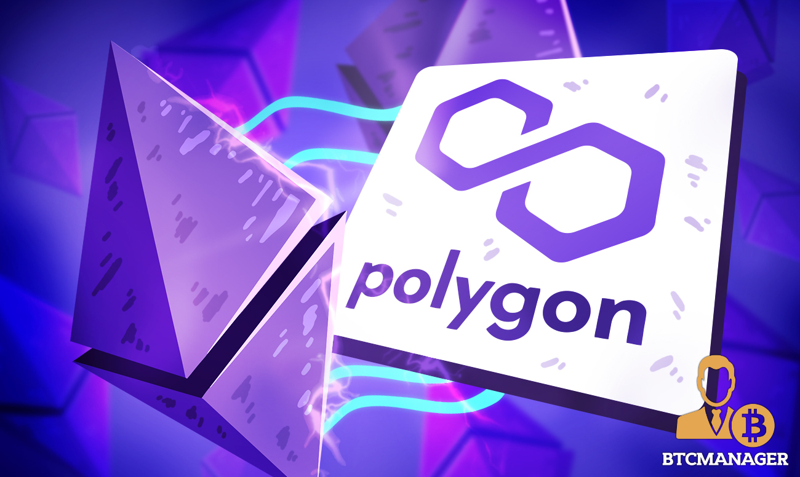
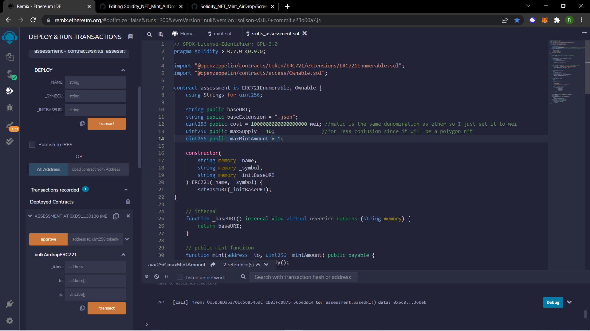
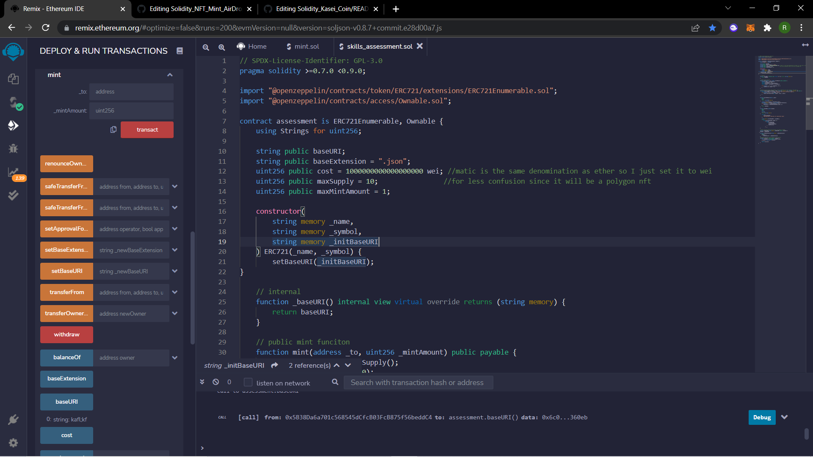

# Solidity Assessment NFT Airdrop/Mint for Polygon Mainnet

## Screenshots of deployed contract on Remix

As you can see the contract deploys correctly. Before you deploy you need to enter the name of the NFT collection, the token ID of the collection, and the URI of the hosted images on IPFS. They do have to be in a JSON format for them to show up correctly on OpenSea. 

Next, you can mass send the NFTs once you put in the contract address, array of addresses, and token id. The owner of the contract can do this all on etherscan.io.

Finally, the mint function where it asks you to enter your address and how many you'd like to mint. I set the contract at one mint per address but can be changed to whatever the owner feels is best.
